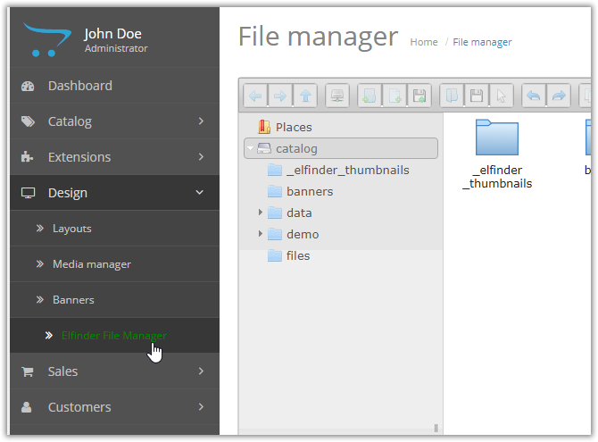

# ElFinderFileManager
First official plugin for Copona system. Uses Elfinder as FileManager in Admin

# Installation

1. Create folder under extensions:

`mkdir -p extensions/Copona/ElFinderFileManager`

2. Go to created folder and clone Git repository:

`git clone https://github.com/copona/ElFinderFileManager.git .`
